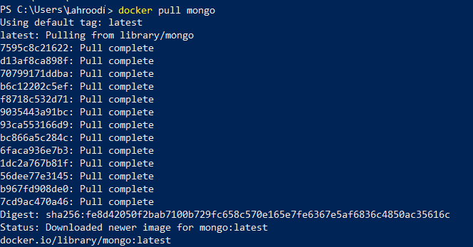
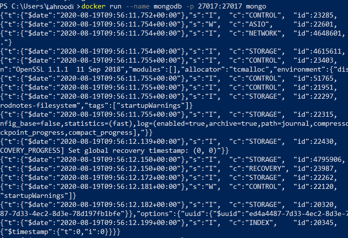
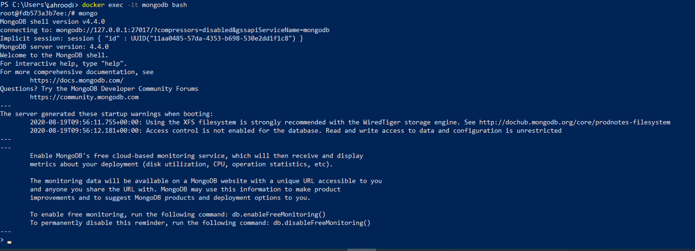
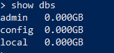
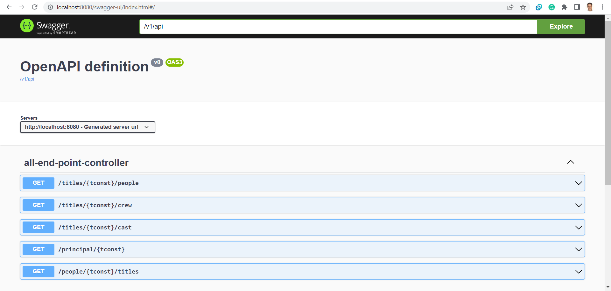
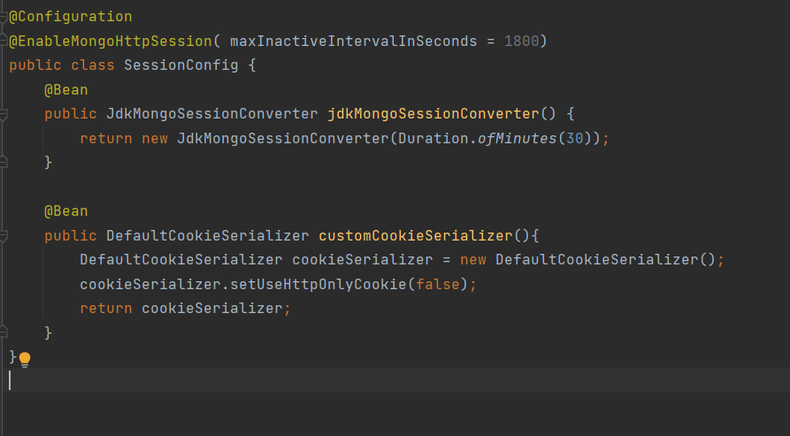
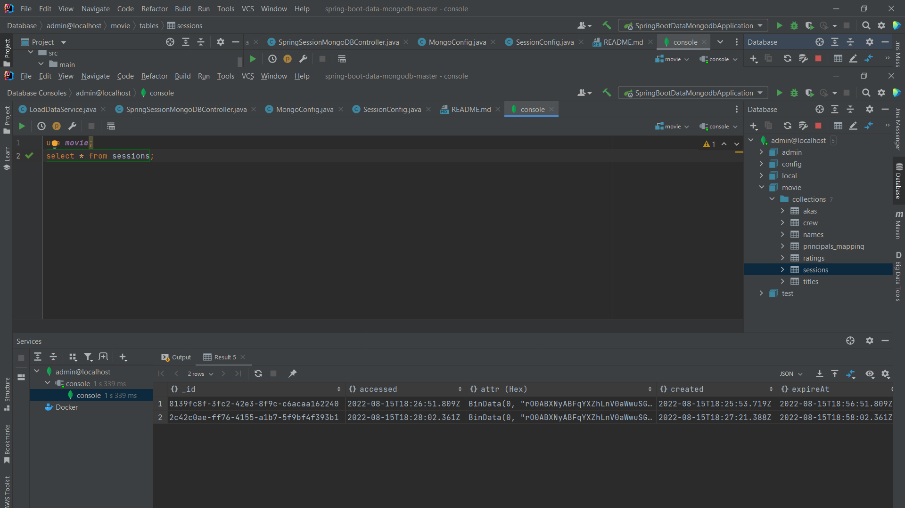

# Spring Boot MongoDB CRUD example - Restful CRUD API

# Building Spring Boot MongoDB CRUD RESTful java application.
> #### Created by : Alireza Gholamzadeh Lahroodi
#### Email Address : AlirezaGholamzadehLahrudi@gmail.com
> #### [Linkedin Profile](https://www.linkedin.com/in/alireza-gholamzadeh-lahroodi)


## Config and Run Mongodb


1. Run docker command
> pull mongodb image



2. Run container
> docker run --name mongodb -p 27017:27017 mongo



3. Bash to container for crate user
> docker exec -it mongodb bash



4. Go to mongo management
> mongo

5. Show db to use db



6. Use db for create user
> use movie

7. Create user and password

> db.createUser({
user: "imdb",
pwd: "imdb",
roles: [ { role: "root", db: "movie" } ]
})

### View documentation
Use the following path to view the documentation produced by open-api and
swagger use the following path, after the execution
> Swagger url : http://localhost:8080/documentation.html



### Guide to Spring Session

Spring Session has the simple goal of free up session management from the limitations of the HTTP session stored in the server.
The solution makes it easy to share session data between services in the cloud without being tied to a single container (i.e. Tomcat). Additionally, it supports multiple sessions in the same browser and sending sessions in a header.
For enabling this feature, doing following :

> 

> 

### Run application
```
mvn spring-boot:run
```